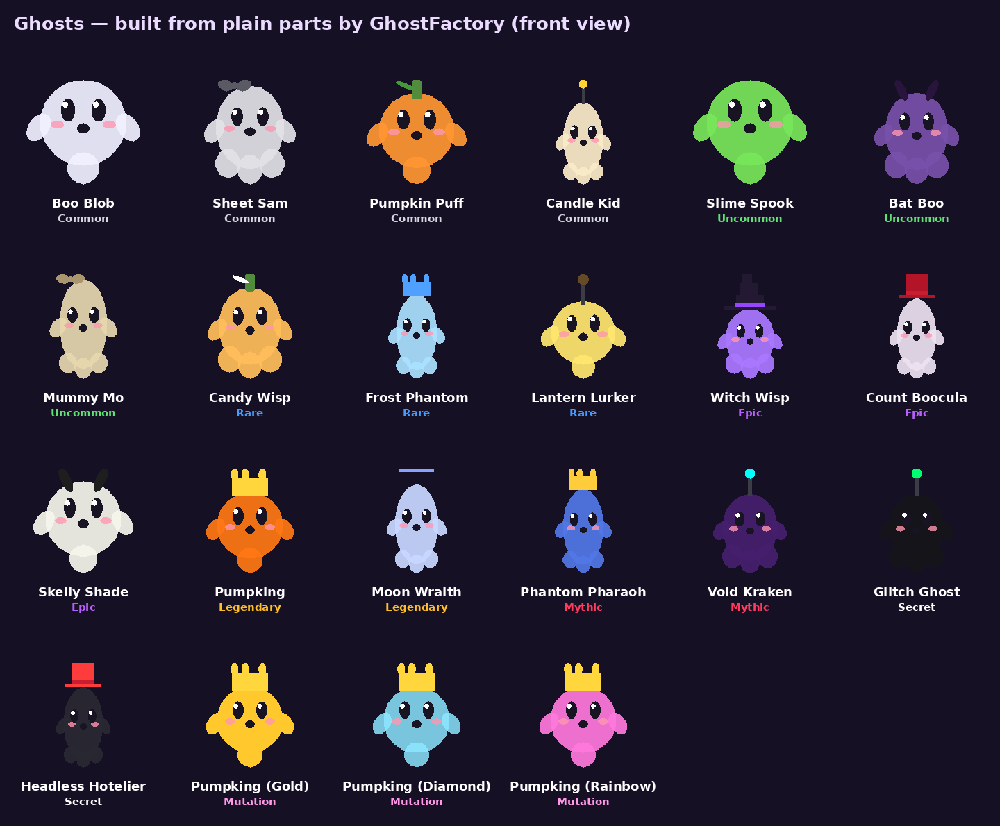
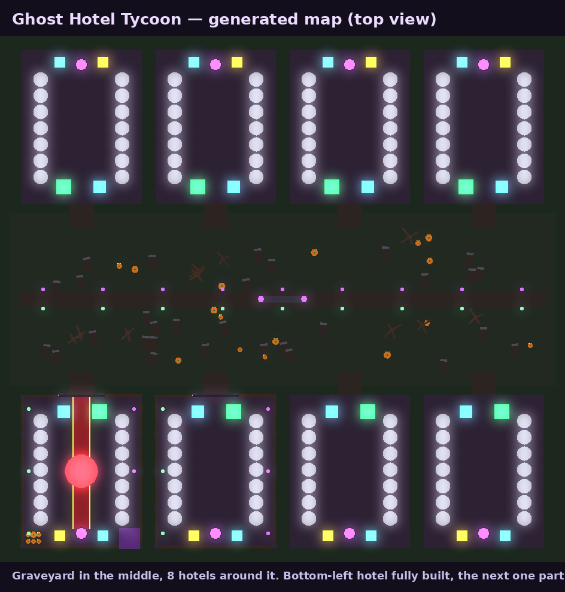

# 👻 Ghost Hotel Tycoon

Тайкон для Roblox к Хеллоуину. На ночном кладбище летают призраки: ловишь их
пылесосом, приносишь в свой отель и заселяешь по номерам. Каждый постоялец
приносит деньги. На них ты достраиваешь отель, прокачиваешь пылесос и рюкзак,
открываешь новые номера и в итоге делаешь перерождение.

Вся игра сделана кодом. Карта, отели и призраки собираются из обычных
деталей при старте сервера, поэтому загружать модели или картинки не нужно.




## Геймплей

| Механика | Как работает |
|---|---|
| 🌀 **Ловля призраков** | Возьми Ghost Vacuum и **держи клик** рядом с призраком. Луч притягивает его и заполняет шкалу. Редких ловить дольше, чем обычных. Если несколько игроков тянут одного призрака, он достаётся тому, кто первым заполнит шкалу. |
| 🏨 **Заселение** | Зайди в свой отель, и призраки из рюкзака сами разойдутся по свободным номерам. |
| 💰 **Доход** | Каждый призрак приносит $/сек. Деньги копятся в зелёной кассе, наступи на неё, чтобы забрать. |
| 🔨 **Кнопки стройки** | Синяя кнопка у входа строит отель по частям: забор → фонари → неоновая вывеска → красная дорожка → фонтан из слизи → башня → тыквенный сад → Кровавая Луна. Каждая часть даёт +% к доходу и ★ к рейтингу отеля. |
| 🔓 **Номера** | Сначала открыто 4 номера, остальные покупаются (до 12). Ещё 2 золотых номера открываются с VIP. |
| ⬆️ **Апгрейды** | Станции в глубине отеля: сила пылесоса (до 10 уровня) и вместимость рюкзака (до 8 уровня). |
| 🧪 **Котёл слияния** | 3 одинаковых призрака сливаются в 1 мутированного: обычный → Gold (×4) → Diamond (×15) → Rainbow (×50). |
| 🌕 **Ведьмин час** | Раз в 10 минут наступает ночь: редкие призраки выпадают в 3 раза чаще и появляются в 2 раза быстрее. |
| ♻️ **Перерождение** | Сбрасывает прогресс, но навсегда даёт +50% к доходу и +15% к силе пылесоса. |
| 🌙 **Офлайн-доход** | Пока тебя нет, призраки зарабатывают 10% дохода, максимум за 2 часа. |

Редкости: Common, Uncommon, Rare, Epic, Legendary, Mythic, Secret (19
призраков). Появление и поимка Legendary и выше объявляются всему серверу.

## Монетизация

**Game Passes** (разовая покупка):

| Название (точно так) | Эффект | Цена (совет) |
|---|---|---|
| `2x Cash` | ×2 ко всему доходу | 199 R$ |
| `VIP` | 2 VIP-номера, +20% дохода, тег [VIP] в чате | 299 R$ |
| `Mega Vacuum` | ловля ×2 быстрее | 249 R$ |
| `Big Backpack` | +5 мест в рюкзаке | 149 R$ |
| `Speed Coil` | +50% к скорости бега | 99 R$ |

**Developer Products** (можно покупать много раз):

| Название (точно так) | Эффект | Цена (совет) |
|---|---|---|
| `Small Cash Pack` | доход за 10 мин (минимум $1K) | 25 R$ |
| `Medium Cash Pack` | доход за 60 мин (минимум $10K) | 99 R$ |
| `Huge Cash Pack` | доход за 5 ч (минимум $100K) | 399 R$ |
| `Summon Witching Hour` | Ведьмин час на 5 минут для **всего сервера** | 149 R$ |

Premium-подписчики получают +10% к доходу. Premium Payouts Roblox
начисляет за время, которое они проводят в игре.

Шансы выпадения (обычные и в Ведьмин час) показаны прямо в магазине, как
требуют правила Roblox для платных случайных механик.

## Публикация: пошагово

1. Скачай **`GhostHotelTycoon.rbxlx`** из этой папки и открой его в
   Roblox Studio.
2. **File → Publish to Roblox** → *New experience* → назови
   «Ghost Hotel Tycoon».
3. **Game Settings**:
   - *Places → Server size* = **8** (в игре 8 отелей);
   - *Security → Enable Studio Access to API Services* включи, если хочешь,
     чтобы сохранения работали и при тестах в Studio;
   - *Avatar* оставь R15.
4. **Creator Dashboard → твоя игра → Monetization**:
   - *Passes* — создай 5 пассов с **точными** названиями из таблицы;
   - *Developer Products* — создай 4 продукта с **точными** названиями.
     Их ID игра найдёт сама по названию, вписывать не нужно.
5. Открой `ReplicatedStorage → Shared → Config` и в `Config.GamePasses`
   впиши `Id` каждого пасса (число из ссылки на пасс).
6. Снова **File → Publish to Roblox**, затем в настройках игры сделай её
   **Public**.
7. Заполни *Experience Questionnaire* (в игре есть лёгкие «страшные»
   мотивы: призраки и кладбище).

Пока ID не вписаны, кнопки в магазине показывают «Coming soon» и всё
остальное работает.

## Разработка

Проект собирается [Rojo](https://rojo.space) 7.7:

```text
ghost-hotel-tycoon/
├─ default.project.json   # дерево игры для Rojo
├─ src/shared/            # ReplicatedStorage.Shared: конфиг, формулы, шансы, фабрика призраков
├─ src/server/            # ServerScriptService.Server: данные, карта, отель, ловля, донат
├─ src/client/            # StarterPlayerScripts.Client: HUD, магазин, эффекты
└─ tests/                 # офлайн-тесты на Lune
```

```bash
rojo build -o GhostHotelTycoon.rbxlx   # собрать файл места
rojo serve                              # живая синхронизация с Studio (плагин Rojo)
stylua src && selene src                # формат и линт (selene generate-roblox-std один раз)
lune run tests/run                      # модульные тесты + сборка карты на настоящих инстансах
lune run tests/simulate                 # сквозная симуляция сервера (нужен пропатченный Lune, см. tests/README.md)
```

Баланс (цены, доход, шансы, награды) весь лежит в `src/shared/Config.luau`.

### Автопубликация из GitHub

Воркфлоу `.github/workflows/ghost-hotel.yml` на каждый пуш собирает место и
прогоняет тесты. Когда настроишь Open Cloud, он ещё и публикует игру:

1. [Creator Dashboard → Open Cloud → API Keys](https://create.roblox.com/dashboard/credentials):
   создай ключ с доступом **universe-places: write** для этой игры.
2. В GitHub-репозитории: *Settings → Secrets and variables → Actions*:
   - secret `ROBLOX_API_KEY` — сам ключ;
   - variables `ROBLOX_UNIVERSE_ID` и `ROBLOX_PLACE_ID` — ID игры и места.
3. Запусти воркфлоу вручную (*Run workflow*) или запушь в `main`.
