# Бабка: Кооп

Кооперативный 3D‑хоррор в духе Granny: **2 игрока (до 4) против бабки‑ИИ**, мультиплеер по локальной сети или через **Radmin VPN**.
Это отдельная игра, сделанная с нуля, а не мод оригинала. Код, дом, мебель, текстуры, анимации и звуки написаны здесь. Персонажи построены из открытой базы MakeHuman (CC0), часть мебели взята из образцов Khronos glTF (CC0 / CC‑BY, авторы перечислены в `public/models/props/CREDITS.txt`).

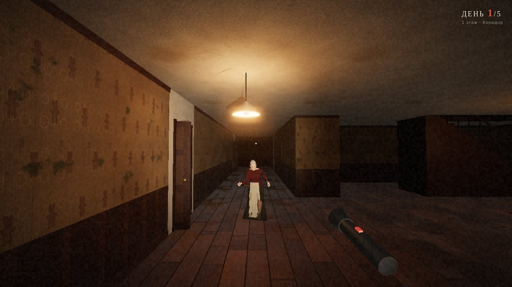

У вас есть **5 дней**, чтобы выбраться из трёхэтажного дома. Выходов три:

| Выход | Что нужно |
|---|---|
| **Входная дверь** (прихожая) | навесной замок (ключ), доски (молоток), цепь (кусачки) |
| **Машина** в гараже | канистра с бензином и ключ зажигания. Потом нужно 4,5 секунды не отходить, пока машина заводится |
| **Канализация** в подвале | болты (гаечный ключ) и решётка (лом) |

Предметы каждый раз лежат в новых местах, часть из них спрятана в запертых **кладовке** и **кабинете** (ключи от них тоже в доме).
Бабка ходит по всем этажам, слышит шаги и скрип половиц даже через перекрытия, открывает двери, проверяет укрытия и ставит капканы. Если она кого-то поймает, наступает следующий день.
Прятаться можно в шкафу, под кроватью, в ванне и **под столом**.

## Установка (Windows)

**Самый простой способ:** скачайте **[BabkaCoop-Setup.exe](https://github.com/mrsmartass700-blip/mrsmartass700-blip/releases/tag/babka-latest)** и запустите его. Больше ничего скачивать не нужно: Node.js и все файлы игры уже внутри.

Мастер установки откроется в отдельном окне и сделает всё сам:
* скопирует игру (по умолчанию в `%LOCALAPPDATA%\BabkaCoop`, права администратора не нужны);
* создаст ярлыки на рабочем столе и в меню «Пуск»;
* добавит правило брандмауэра для порта игры, чтобы друг мог подключиться (Windows попросит подтверждение);
* пропишет игру в «Параметры → Приложения» вместе с деинсталлятором.

Windows может показать окно «Windows защитила ваш компьютер», потому что у файла нет цифровой подписи. Нажмите «Подробнее» → «Выполнить в любом случае».

| | |
|---|---|
|  | 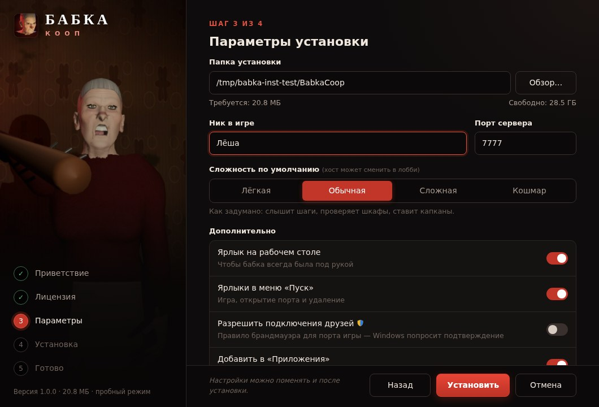 |
| 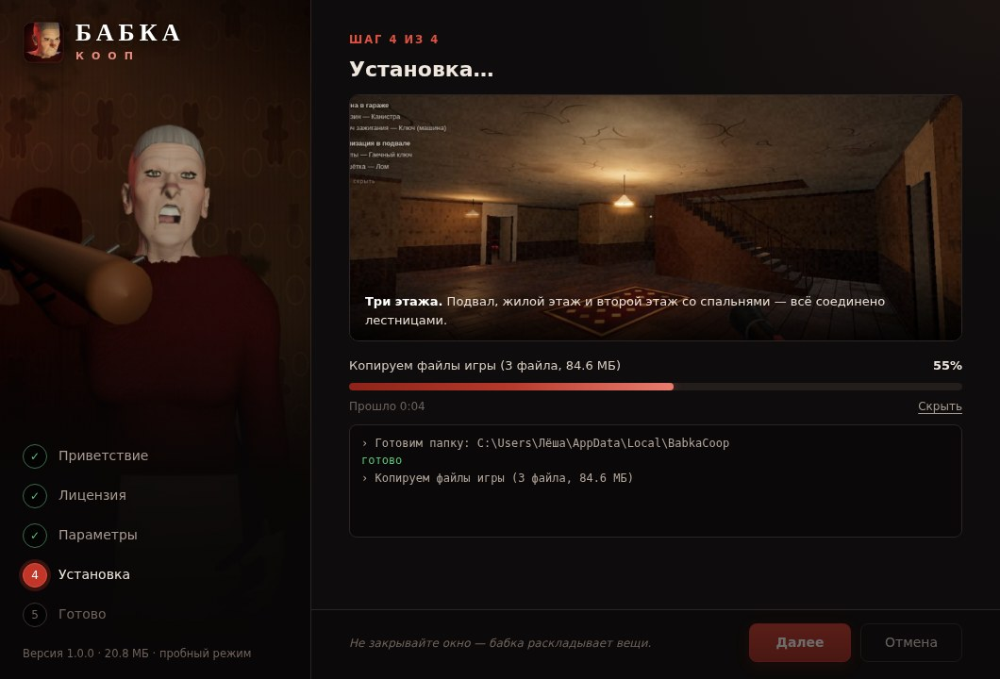 | 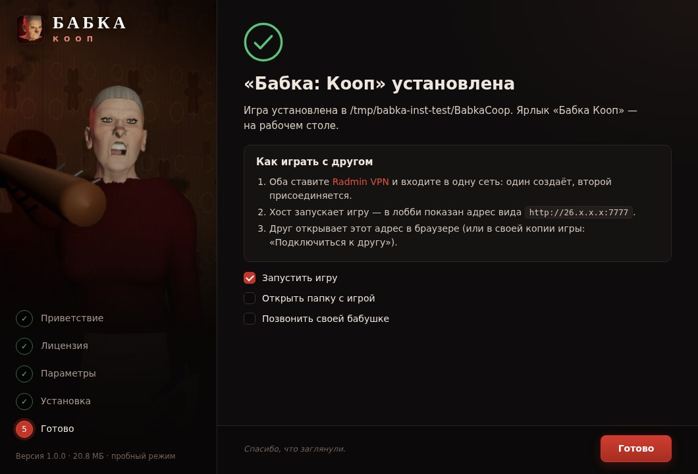 |

Другие способы:
* **Портативно:** `BabkaCoop.exe` из того же релиза запускается без установки.
* **Из исходников:** `SETUP.bat` (сам скачает портативный Node.js, если его нет) или [Node.js](https://nodejs.org) + `start.bat` (Linux/macOS: `./start.sh`).

Игра открывается в своём окне без вкладок и адресной строки (Edge или Chrome в режиме приложения). Когда окно закрыто и в игре никого не осталось, сервер выключается сам. Лог пишется в `%LOCALAPPDATA%\BabkaCoop\logs`.

## Игра с другом по Radmin VPN

1. Оба ставите [Radmin VPN](https://www.radmin-vpn.com/ru/) и заходите в одну сеть: один нажимает «Создать сеть», второй «Присоединиться к сети».
2. **Хост** запускает игру. В лобби показан адрес вида `http://26.x.x.x:7777`, отправьте его другу.
3. **Друг** открывает этот адрес в браузере. Если игра у него тоже установлена, можно вписать адрес в главном меню: «Подключиться к другу».
4. Друг нажимает «Я готов», хост выбирает сложность и нажимает «Начать игру».

Если друг не может подключиться, у хоста: «Пуск → Бабка Кооп → Открыть порт в брандмауэре».
В одной домашней сети Radmin не нужен, подойдёт обычный локальный адрес из лобби.

## Скриншоты

| | |
|---|---|
| 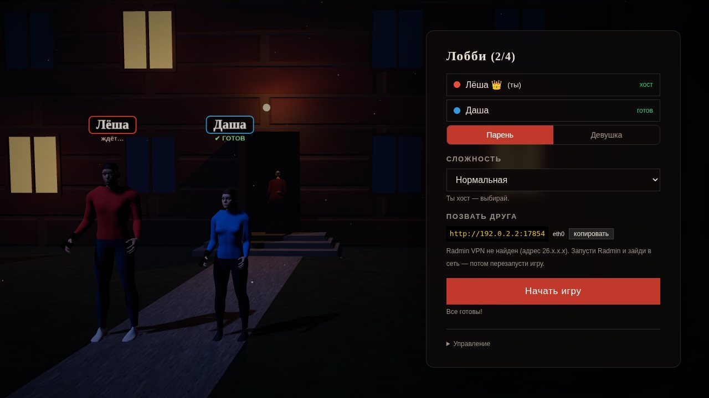 | 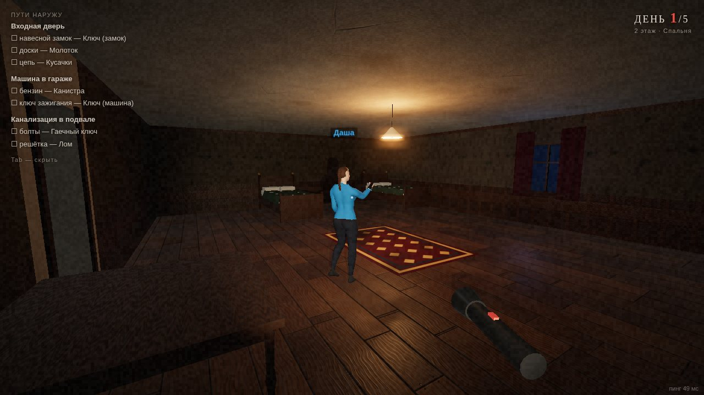 |
|  | 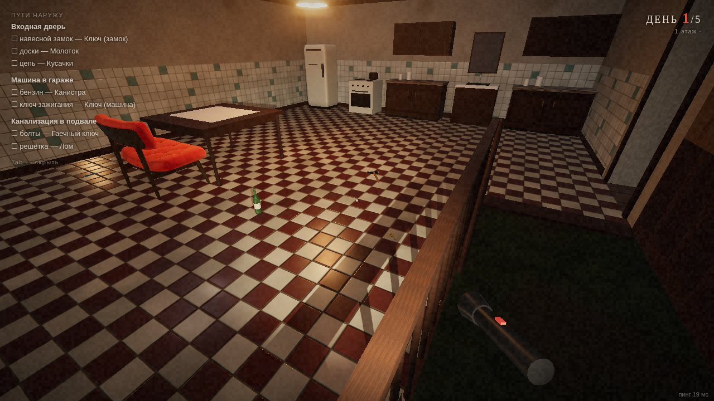 |
| 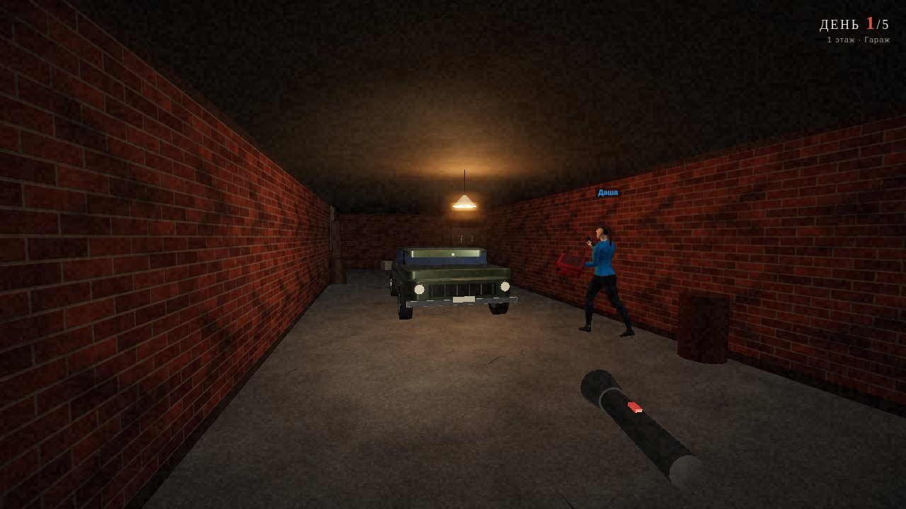 | 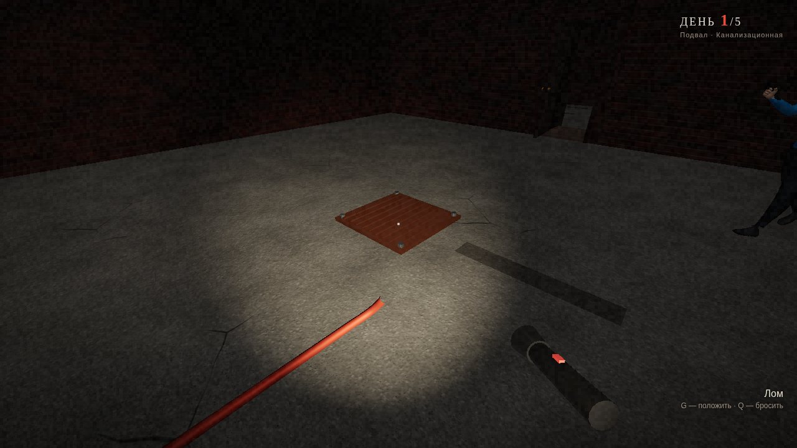 |
| 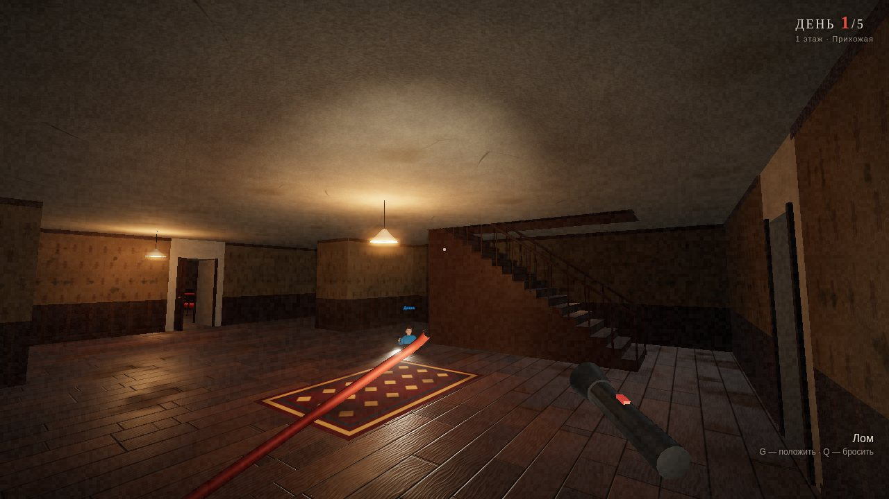 | 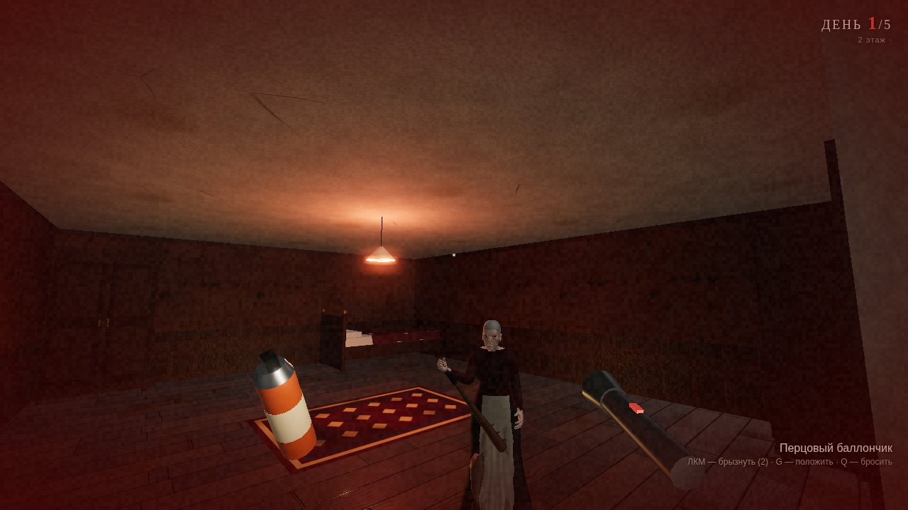 |

## Управление

| Клавиша | Действие |
|---|---|
| WASD / мышь | ходить / смотреть |
| Shift | бег (громко, тратит выносливость) |
| C или Ctrl | присесть (тихо) |
| E | открыть дверь, взять предмет, спрятаться, применить предмет к замку, завести машину |
| G / Q | положить / бросить предмет (бросок шумит и отвлекает бабку, бутылка бьётся громко) |
| ЛКМ | перцовый баллончик (оглушает бабку, 3 заряда) |
| F | фонарик |
| Z | метка для друга (видна сквозь стены) |
| T / Enter | чат |
| Tab | список задач |
| Esc | пауза (для остальных игра не останавливается) |

## Сложность

Практика (без бабки) · Лёгкая · Нормальная · Сложная · Кошмар (в доме темно, бабка бегает и слышит всё).

## Как устроено

* `server/`: авторитетный сервер на Node.js без зависимостей, со своим WebSocket, 20 тиков в секунду. ИИ бабки: A* по трём этажам с переходами по лестницам, зрение (FOV + прямая видимость), слух через перекрытия, состояния «патруль / проверить шум / погоня / поиск / оглушена».
* `shared/`: карта дома (`levels.js`) и правила движения, общие для сервера и клиента.
* `public/`: клиент на three.js.
  * PBR‑материалы (цвет + нормали + шероховатость), ACES и bloom.
  * Скелетные персонажи с процедурной анимацией и мимикой.
  * 3D‑лобби.
  * Звук синтезируется через WebAudio: HRTF, реверберация по помещению, шаги по разным поверхностям, музыка.
* `tools/`: генераторы ассетов.
  * `build-humans.mjs`: персонажи из MakeHuman: морфинг, скелет, одежда, запечённая кожа.
  * `build-textures.mjs`: бесшовные PBR‑текстуры.
  * `render-art.mjs`: иконка и обложка из 3D‑модели.
  * `build-exe.mjs`: сборка одного `.exe` через Node SEA с иконкой и подсистемой GUI.
* `installer/`: мастер установки (локальный Node‑бэкенд, интерфейс в окне приложения, ярлыки через IShellLinkW, брандмауэр, реестр, деинсталлятор).
* `test/`: `npm test` прогоняет логику игры, ИИ на всех этажах, все три побега, сетевую игру двух клиентов и пробную установку. `test/exe-smoke.js` проверяет собранный `.exe` (в CI на Windows, с полной установкой).

Порт и сложность по умолчанию хранятся в `config.json` рядом с игрой (его создаёт установщик): `{ "port": 7777, "difficulty": "normal" }`.
Порт можно указать и при запуске: `BabkaCoop.exe 7778`.
